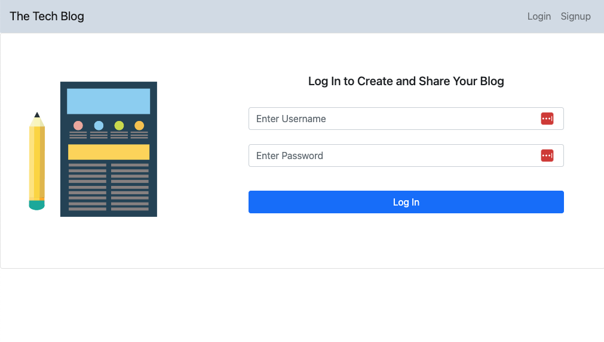

# Tech Blog

## Description

The application shows a CMS style blog site where developers can publish their blog posts and comment on other developers’ posts as well. The app follows the MVC paradigm in its architectural structure, using Handlebars.js as the templating language, Sequelize as the ORM, and the express-session npm package for authentication.

## Functionality

Given a CMS-style blog site, when a user visits the site they are presented with a homepage, which includes existing blog posts if any exit.  When the use clicks on the homepage option, they are taken to the same homepage and presented with existing blog posts if any exist.  When the user clicks on the sign up option they are taken to a sign up page and prompted for a username and password.  When the user clicks on the login option they are taken to the login page and prompted for a username and password.  When the user clicks on the dashboard option they are taken to the dashboard page.

The user credentials are saved when the user logs into the site and if they later revisit the site and choose to login. 

On the homepage, when the user clicks on an existing blog post they are presented with the post title, contents, post creator's username and date the post is created.  The user has the option to leave a comment for the post.  If logged in, when the user clicks on the submit button for the comment that coment is saved and the post is updated to display the comment, the comment creator's username and the date the comment is added.

When the user clicks on the dashboard option, they are presented with any blog posts they have personally created and the option to add a new blog post.  WHen the user click on the button to add the new blog post they are prompted to enter a title and content for that blog post.  When the user clicks on the button to "create" the new blog post the title and contents of the post are saved and the user is taken back to an updated dashboard with their new blog post. 

When the user clicks on one of their existing posts in the dashbaord, they are able to delete or update the post.  Upon completing the action the are taken back to the updated dashboard.

When the user clicks on the logout option in the navigation, they are signed out of the site.

When the site is idle for more than a set time, the user is able to view posts and comments, but is prompted to login if they attempt to add, update or delete comments.

## Code

The application uses [MySQL2](https://www.npmjs.com/package/mysql2) and [Sequelize](https://www.npmjs.com/package/sequelize) packages to connect the Express.js API to a MySQL database and the [dotenv](https://www.npmjs.com/package/dotenv) package to use environment variables to store sensitive data.

Comments have been applied to the different files in the code to identify each section of code. 

There is a server.js file that starts the application.

Included is a package.json file with the required dependencies, as well as gitignore, node_modules and .DS_Store files.

## Installation

The code for this project can be found on GitHub at: https://github.com/c-alanwill/tech-blog

The site is deployed at: https://techytblog.herokuapp.com/

## Usage

The following image shows the application's login page:

## Credits

N/A

## License

Please refer to the license in the repo.

## Contributing

N/A